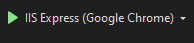

# 🎓 Alçada do Aluno - ASP.NET

O **Alçada do Aluno** é uma **sistema WEB** desenvolvida para **fins acadêmicos**. Trata-se de uma **aplicação WEB para instiuições acadêmicas**, criada com o objetivo de praticar conceitos de desenvolvimento web.

---


## 📋 Sumário

- [Sobre o Projeto](#sobre-o-projeto)
- [Funcionalidades](#funcionalidades)
- [Tecnologias Utilizadas](#tecnologias-utilizadas)
- [Pré-requisitos](#pré-requisitos)
- [Como Executar o Projeto](#como-executar-o-projeto)
- [Licença](#licença)

---


## 📌 Sobre o Projeto

O **Alçada do Aluno** é um **sistema** com o objetivo de melhorar a comunicação entre alunos e a instituição matriculada para sanar eventuais dúvidas. O foco do projeto está em **praticar conceitos de front-end utilizando o ASP.NET e C#**:

- C#
- HTML5
- CSS3
- JavaScript ES6+
- ASP.NET

---


## 🚀 Funcionalidades

- 🌐 Interface limpa e responsiva;
- ⚙️ CRUD;
- 👨‍💻 Autenticação de usuário.

---


## 🧰 Tecnologias Utilizadas

- C#
- HTML5
- CSS3
- Bootstrap
- JavaScript ES6+
- ASP.NET
- .NET

---


## ⚙️ Pré-requisitos

Certifique-se de ter instalado:

- [Visual Studio](https://visualstudio.microsoft.com/pt-br/)

---


## ▶️ Como Executar o Projeto

1. **Clone o repositório**

```bash
git clone https://github.com/maugois/AlcadaDoAluno_ASP.NET
```

2. **Execute o projeto**

Após abrir o projeto no visual studio 2022, aperte o botão no topo como está na imagem abaixo:



3. **Acesse o projeto**

http://localhost:(porta)/index.aspx


## 📕 Licença

Este projeto está licenciado sob a Licença MIT. 
Veja o arquivo LICENSE para mais detalhes.

Veja o arquivo [LICENSE](LICENSE) para mais detalhes.   
